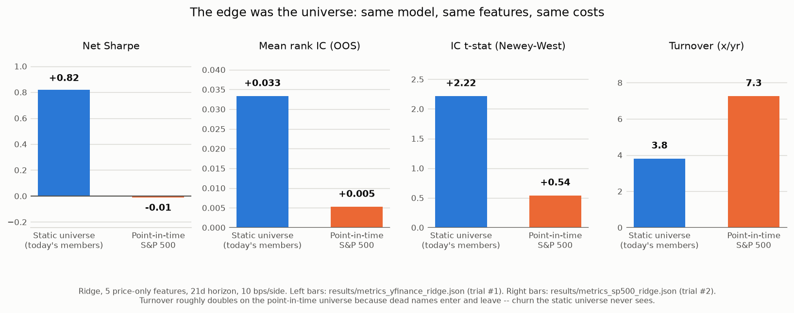

# Case study: the edge was the universe

*A worked example of a result that did not survive its own control.*

Every number below links to a committed artifact. The chart is regenerated
offline from those artifacts by `python scripts/case_study_chart.py`.

---

## Question

Do five standard cross-sectional price features — 12-1 momentum, 6-1 momentum,
short-term reversal, realised volatility, and distance from the 52-week high —
carry tradable signal in liquid US large caps, **net of costs**, out of sample?

This is the most-attempted question in retail quant, which is precisely why it
is worth doing carefully: the published record says the honest answer is
probably "no" (McLean & Pontiff 2016; Novy-Marx & Velikov 2016), and a study
that finds "yes" owes an explanation of what it did differently.

## Experiment

| | |
|---|---|
| Universe | 60 liquid US large caps + sector ETFs, **as constituted today**; 57 survive the 90%-coverage filter |
| Window | 2010-01-01 → 2026-06 (3,126 out-of-sample days) |
| Features | 5 price-only, cross-sectionally z-scored, past data only |
| Label | 21-day forward return |
| Model | Ridge (α = 10) |
| Validation | Expanding walk-forward, 21-day embargo between train and test |
| Portfolio | Dollar-neutral decile long/short, monthly rebalance |
| Costs | 10 bps per side, charged on every unit of turnover |

Command shape (real-data runs are registration-gated, so a rerun declares
itself): `python scripts/run_pipeline.py --data yfinance --model ridge --n-trials 6 --reproduce "<reason>"`. The committed artifact was written at
`--n-trials 6`; the original trial-#1 run was graded at N=1 (see the log row).
Artifact: [`results/metrics_yfinance_ridge.json`](../results/metrics_yfinance_ridge.json) ·
log row: `research_log.md` trial #1, 2026-06-10.

## Initial result — encouraging, and wrong

| metric | value |
|---|---|
| Mean rank IC (OOS) | **+0.0333** |
| Net Sharpe | **+0.82** |
| Gross Sharpe | +0.89 |
| Annual turnover | 3.81× |
| Max drawdown | −29% |
| 12-1 momentum baseline (net) | +0.34 |
| Equal-weight 1/N | +1.00 |

A net Sharpe of 0.82 that beats a momentum baseline is, on its face, a
portfolio-worthy result. Two things in that table said otherwise before any
control was run:

1. **The equal-weight long-only portfolio earned a Sharpe of 1.00.** A universe
   in which buying everything and holding it beats the strategy is not a
   neutral testing ground; it is a universe that was selected for having gone
   up. That single number is what made the result suspect.
2. **The originally reported t-stat was 7.77** — computed with `ic.sem()`,
   which assumes independent observations. The daily ICs of overlapping 21-day
   labels are autocorrelated roughly 20/21 of the way. Under Newey–West the
   same data gives **t = 2.22**. Nothing about the world changed; the standard
   error was simply wrong by a factor of three and a half.

So the result was logged as *"encouraging but NOT yet trustworthy"* and barred
from any write-up until the control ran. That entry is dated the same day as
the result, before the control's outcome was known.

## The stronger control

The suspicion has a specific name: **survivorship bias**. The 60 tickers were
the mega-caps of *today*. A firm that blew up in 2015 is not in the list; one
that IPO'd in 2019 has a full history that was unknowable in 2010. Reversal
features are especially flattered by this — "buy the dip" is a reliable
strategy when every dip in the sample is known in advance to have recovered.

**The control:** rebuild the universe point-in-time. `src/quantlab/universe.py`
walks the Wikipedia S&P 500 changes table backwards from today's membership to
reconstruct who was actually in the index on each date — **810 distinct members
across the window**, with a membership mask so a name contributes only while it
was genuinely a constituent. Everything else — features, model, embargo,
portfolio construction, costs — is held identical. One variable moves.

Command shape: `python scripts/run_pipeline.py --data sp500 --model ridge --n-trials 2 --reproduce "<reason>"`.
Artifacts: [`results/metrics_sp500_ridge.json`](../results/metrics_sp500_ridge.json),
[`results/sp500_pit_coverage.json`](../results/sp500_pit_coverage.json) ·
log row: trial #2.

## Revised conclusion — the edge was the universe

| metric | static universe | point-in-time | change |
|---|---|---|---|
| Mean rank IC (OOS) | +0.0333 | **+0.0052** | −84% |
| IC t-stat (Newey–West) | +2.22 | **+0.54** | not significant |
| Net Sharpe | +0.82 | **−0.01** | edge gone |
| Gross Sharpe | +0.89 | +0.18 | |
| Annual turnover | 3.81× | **7.26×** | nearly doubled |
| OOS days | 3,126 | 3,378 | |

**The entire apparent edge was hindsight in the universe selection.** Same
features, same model, same embargo, same cost model, same code path — one
control, and a net Sharpe of 0.82 becomes −0.01 with a t-stat that cannot
reject zero.

Two secondary observations that matter as much as the headline:

- **Turnover nearly doubled** (3.81× → 7.26×/yr). A point-in-time universe has
  entries and exits; names appear, delist, get acquired. That churn is real
  trading the static universe never has to pay for. Even had the gross signal
  survived, the cost base roughly doubled underneath it.
- **The gross Sharpe fell too** (0.89 → 0.18), so this is not a costs story
  dressed up as a bias story. The predictive content itself was mostly
  hindsight.

This is McLean & Pontiff reproduced in-house, on my own result, at student
scale — and it is the single most useful thing this project has produced. The
finding is not "the strategy failed." The finding is **"the control changed the
answer, and the control was right."**

### A note on the Deflated Sharpe ratio

The two runs carry different trial counts (`--n-trials 6` and `2`), so their
DSRs (0.94 and 0.29) are **not** directly comparable and are deliberately kept
off the chart. The DSR benchmark grows with the number of variants tried, which
is the whole point of tracking N honestly; comparing DSRs computed at different
N would be comparing two different questions. The IC, t-stat and net Sharpe
comparisons above hold N fixed at "same model, same features" and are the
apples-to-apples numbers.

---

## Remaining limitations — what this control does *not* fix

The point-in-time universe removes the largest bias. It does not produce a
clean dataset, and the honest conclusion has to be stated at the precision the
data supports.

1. **149 of 810 members are unpriceable** — 18.4% of the universe. Free vendor
   history is thin for names that delisted years ago (`ABMD`, `SIVB`, `YHOO`,
   `MON`, `FRC`, …). The survivorship correction is therefore itself
   incomplete: the *most* dead names are exactly the ones most likely to be
   missing. Quantified in
   [`results/sp500_pit_coverage.json`](../results/sp500_pit_coverage.json)
   (81.6% coverage).
2. **Delisting returns are absent.** When a name vanishes the vendor series
   simply stops; the terminal loss is never charged to the portfolio. A
   scenario run injecting a −30% delisting return moves the result trivially
   ([`results/metrics_sp500_ridge_dlret-30.json`](../results/metrics_sp500_ridge_dlret-30.json):
   net SR +0.014 vs +0.008 at −0%), which bounds this specific residual as
   small *for this already-null result* — it says nothing about how large it
   would be for a strategy that actually traded the dying names.
3. **Wikipedia is not a point-in-time data vendor.** The changes table is
   crowd-maintained, occasionally wrong, and revised. It is a good-faith
   reconstruction, not CRSP. An institutional version of this study uses a
   licensed point-in-time membership file, and I would expect the numbers to
   move somewhat — though not in a direction that rescues the result.
4. **One universe, one market, one regime.** US large caps, 2010–2026, a
   sixteen-year equity bull market with two sharp drawdowns. Nothing here
   generalises to small caps, other countries, or other decades without being
   re-run.
5. **The static-universe run is not a strawman I invented to knock down.** It
   is exactly what a competent, careless version of this project would have
   shipped — and what I would have shipped, had I stopped one step earlier.
   That is the point of including it.

## What the falsification gate did — and did not — catch here

The planted-signal / pure-noise harness is this project's headline safety
mechanism, and it is worth being precise about its scope, because overstating
it would repeat the exact error this case study documents.

**The gate did not catch this.** It could not have. The harness generates
synthetic panels in which every asset exists for the whole window; a synthetic
universe has no delistings, so survivorship bias is invisible to it *by
construction*. The gate was green throughout both runs.

What caught it was a **domain-specific control** — rebuilding the universe
point-in-time — motivated by a suspicious baseline number (equal-weight
Sharpe 1.00). No amount of synthetic leak testing substitutes for knowing what
your data is made of.

The gate catches what it is built to catch: future information entering
through the feature matrix or the label alignment. It has caught real bugs, and
`python scripts/leak_demo.py` shows it going red on a one-line look-ahead in
about three seconds. But a green gate means **"the plumbing did not invent this
result"**, not **"this result is true"**. Bias in the data source, bias in the
universe, and bias in the researcher all sail straight past it. The full list
of what it does not cover is in [`REPRODUCE.md`](../REPRODUCE.md), under *What
the synthetic checks do NOT prove*.

---

## Reproducing this case study

| what | how |
|---|---|
| The chart | `python scripts/case_study_chart.py` — offline, reads the committed metrics JSONs |
| The numbers | Read [`results/metrics_yfinance_ridge.json`](../results/metrics_yfinance_ridge.json) and [`results/metrics_sp500_ridge.json`](../results/metrics_sp500_ridge.json) |
| The provenance | `research_log.md`, trial rows #1 and #2, both dated 2026-06-10 |
| The pipeline itself | `python scripts/reproduce.py` — verifies the machinery offline against `repro/expected.json` |

The two backtests themselves are **not** re-derivable from this repo: they
depend on a yfinance snapshot taken on a specific date, and free vendors
silently re-adjust history (this project measures that drift — see
`results/live/revisions_*.json`). Re-run the pull today and expect different
numbers. That is the honest expectation, and the reason the artifacts are
committed rather than the promise of a rerun.
